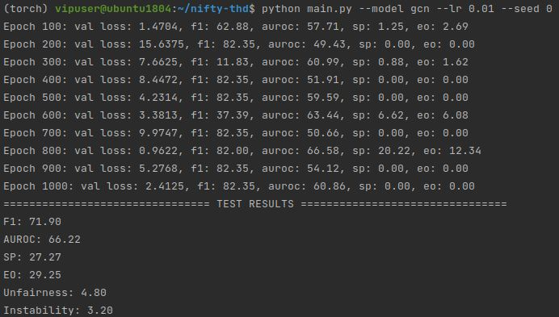
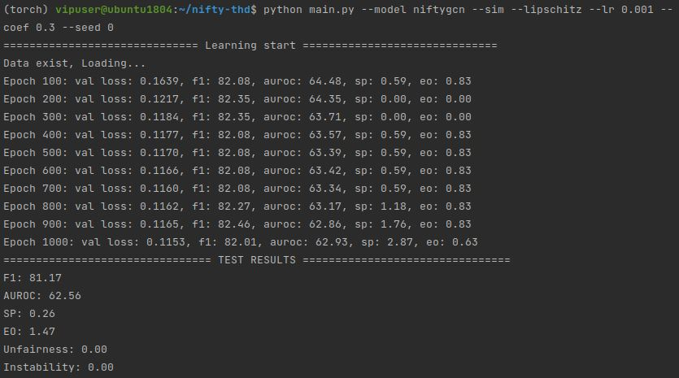

# NIFTY
This is a rough reproduction of [''Towards a Unified Framework for Fair and Stable Graph Representation Learning''](https://arxiv.org/pdf/2102.13186.pdf) on German dataset.

The original code provided by the author is [here](https://github.com/chirag126/nifty)

## Downsides
1. The GCN module and Spectral Normalization in this repository are written by myself from scratch, which is not well optimized(e.g. complexity etc.).
2. The perturbed data generation process is time consuming, which takes about 40 min. So, I tried to save '.npy' files for data.

## Experiments
1. For vanilla GCN, run `python main.py --model gcn`(the learning rate for the results below is 0.01, if lr is set as 0.001, the `sp` and `eo` will be smaller): 
2. For NIFTY-GCN, run `python main.py --model niftygcn --sim --lipschitz`: 
